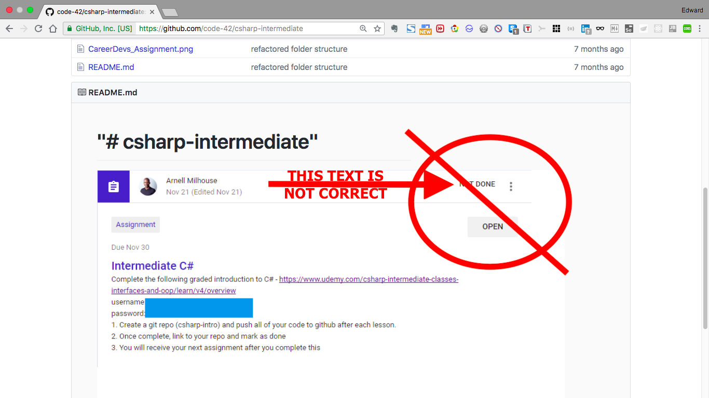

# "c# intermediate" 

# Of Forks and Knives - A Lesson Learned

I got forked on GitHub!  They say imitation is the sincerest form of flattery.    I was so excited, until I saw the mistake in my README file showing the assignment NOT DONE.  Oops, that's not right.  The picture is wrong.  It really did get done, I just got the wrong screenshot in there.  My elation turned into deflation.

The lesson here is: always check and double check your work.

Examples of my work:

- https://github.com/code-42/csharp-intermediate/blob/master/Section%205%20-%20Polymorphism/Lecture%2027%20-%20Method%20Overriding/Lecture%2027%20-%20Method%20Overriding/Program.cs

- https://github.com/code-42/csharp-intermediate/blob/master/Section%205%20-%20Polymorphism/Lecture%2028%20-%20Abstract%20Classes/Lecture%2028%20-%20Abstract%20Classes/Program.cs

- https://github.com/code-42/csharp-intermediate/blob/master/Section%206%20-%20Interfaces/Lecture%2036%20-%20Polymorphism/Lecture%2036%20-%20Polymorphism/Program.cs

So the best I can do at this point is to edit my README and update my repo.  Sorry for the confusion, and the hack job on my README.md

